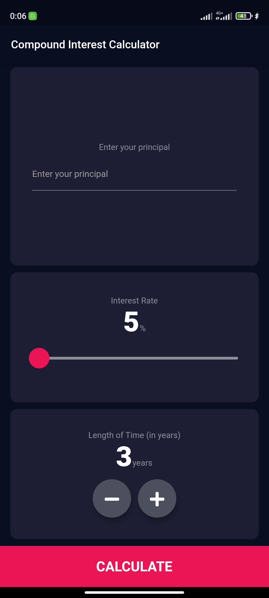
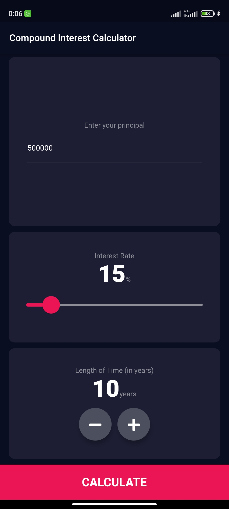
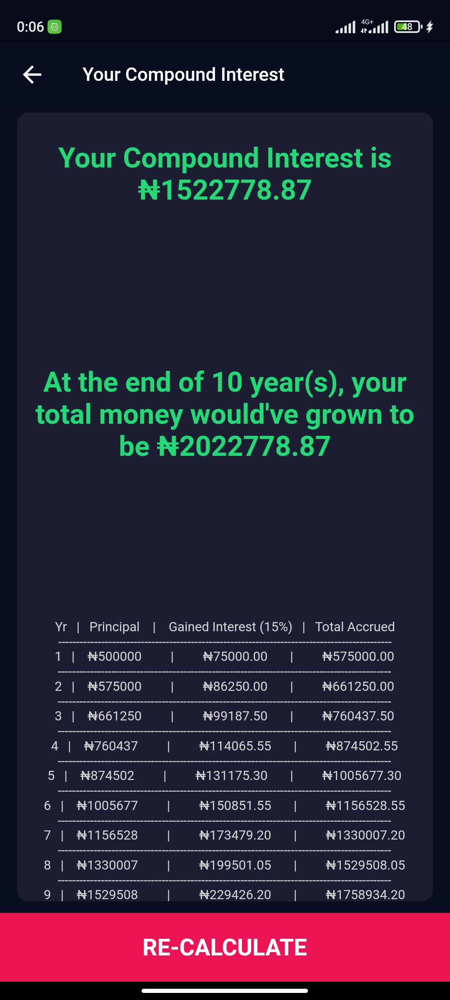

# Compound Interest App (Flutter)

A simple mobile application, created with Flutter, for calculating compound
interest over a period of time.

## Overview and Screenshots
The interface is very simple, containing only a textbox for entering your
principal, a slider to choose your percentage and two buttons to increase
or decrease the number of years you wish to calculate.

The results page shows how much your interest for the period will be, how
much money you have now accrued and a total breakdown of each years gains.

